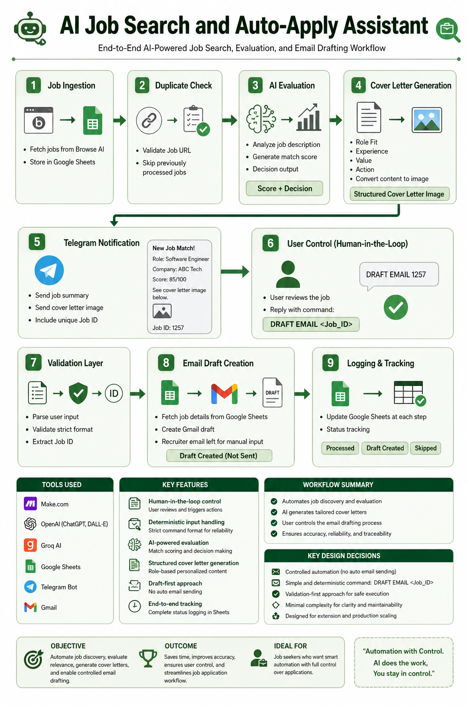
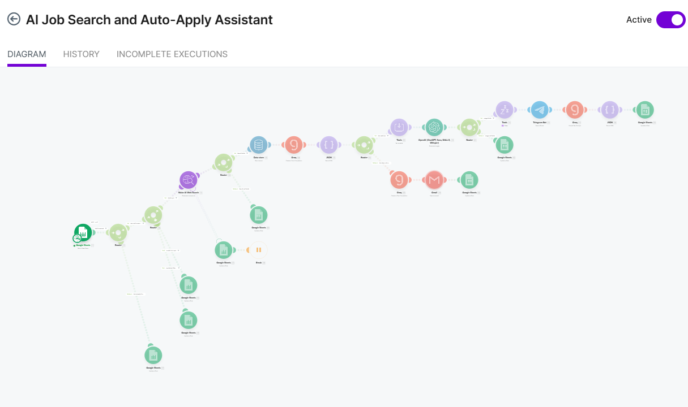
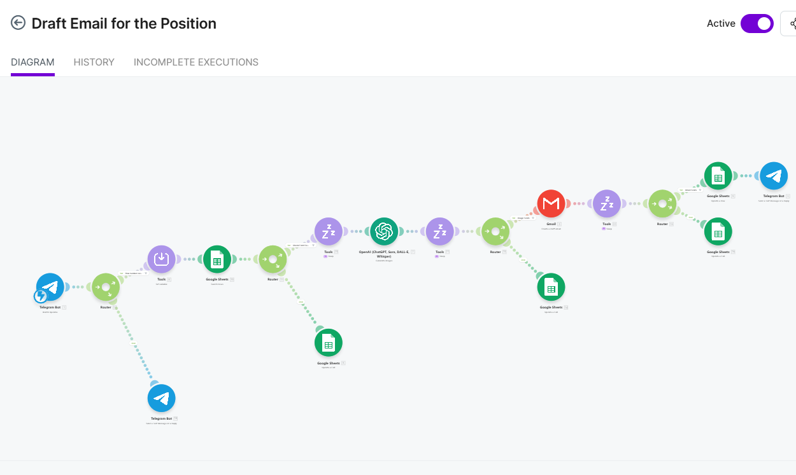
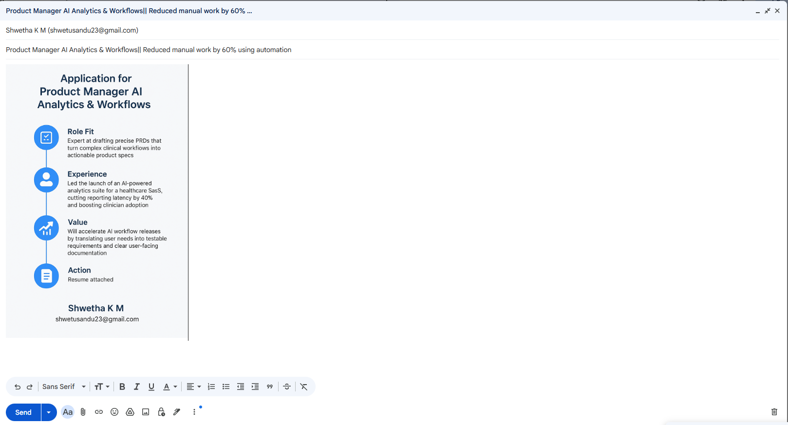
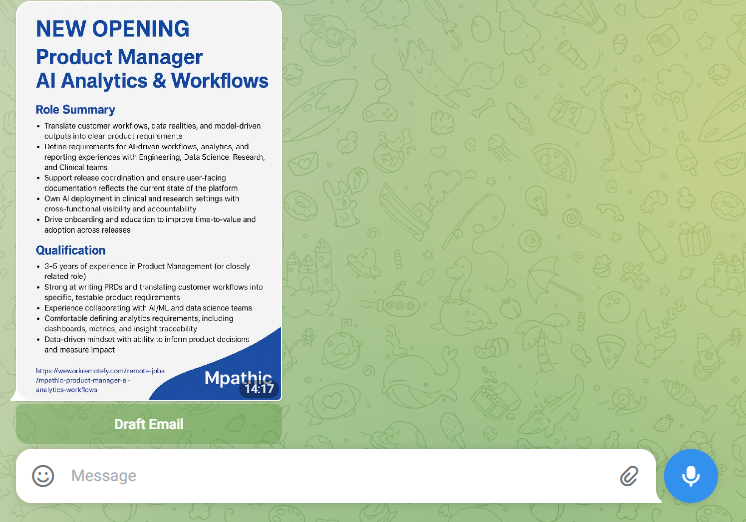

# AI Job Search and Auto-Apply Assistant

# Overview
This project automates the end-to-end job application workflow using Make.com. It fetches job listings, evaluates relevance using AI, generates a tailored cover letter, and allows controlled email drafting through Telegram.
The system focuses on structured decision-making, validation, and human-in-the-loop control instead of fully automated submissions.

I built an end-to-end AI-driven job application assistant using Make.com to automate the job search and application workflow while keeping user control in the loop.
The workflow starts by ingesting job data from Browse AI into Google Sheets. Before processing, I validate and filter out duplicate jobs using the job URL to ensure we don’t reprocess the same listing.
Next, I use AI to analyze each job. It extracts a structured summary and evaluates how well the role matches my profile. Based on this, the system generates a tailored cover letter in a structured format, which is then converted into an image for better readability and presentation.
This output is sent to Telegram along with a unique Job ID. Instead of fully automating the application, I designed a human-in-the-loop step. The user reviews the job and triggers the next action by replying with a command in a strict format.
When the command is received, I validate it rigorously, extract the Job ID, fetch the corresponding job details from Google Sheets, and create a Gmail draft. I intentionally generate a draft instead of sending the email to maintain control and avoid incorrect submissions. The recruiter email is also left for manual input.
Throughout the workflow, I maintain structured logging in Google Sheets to track processing status, decisions, and actions taken.
From a design perspective, I focused on simplicity, deterministic input handling, and clear separation of concerns. I avoided over-engineering with retries and fallbacks to keep the system explainable and reliable for demonstration purposes, while still acknowledging how it can be extended for production use.

________________________________________

# Objective
-	Automate job discovery and evaluation
-	Generate personalized cover letters using AI
-	Enable controlled email drafting
-	Maintain simplicity, traceability, and reliability

________________________________________

# Inforgraphic Overview

________________________________________

# Tools Used
-	Make.com
-	OpenAI (ChatGPT, DALL·E)
-	Groq AI
-	Google Sheets
-	Telegram Bot
-	Gmail
________________________________________

# Workflow Summary
1. Job Ingestion
•	Jobs are fetched from Browse AI
•	Data is stored in Google Sheets
2. Duplicate Check
•	Job URL is validated
•	Previously processed jobs are skipped
3. AI Evaluation
•	Job description is analyzed
•	Match score and decision are generated
4. Cover Letter Generation
•	AI generates structured content:
o	Role Fit
o	Experience
o	Value
o	Action
•	Content is converted into an image
5. Telegram Notification
•	Job summary + cover letter image is sent
•	Unique Job ID is included
•	User decides next action
6. User Trigger (Manual Control)
•	User replies: DRAFT EMAIL <Job_ID>
•	Strict validation ensures correct format
7. Email Draft Creation
•	System fetches job details
•	Gmail draft is created
•	Recruiter email is intentionally left for manual input
8. Logging and Tracking
•	Google Sheets updated at each stage
•	Status includes:
o	Processed
o	Draft Created
o	Skipped

________________________________________

# Key Design Decisions
-> Controlled Automation
-	No automatic email sending
-	Draft creation requires explicit user trigger

-> Simple and Deterministic Input
-	Single command format:

-> DRAFT EMAIL <Job_ID>
-	Avoids multiple input patterns

-> Validation-First Approach
-	Strict parsing of Telegram input
-	Ensures correct execution

-> Minimal Complexity
-	Error handlers and fallbacks intentionally skipped
-	Focus on clarity and maintainability
________________________________________

# Assumptions
-	Google Sheet is append-only
-	No row deletion or sorting
-	Column structure remains fixed
-	Single-user interaction model
________________________________________

# Limitations
-	No retry or fallback mechanism for API failures
-	Row-based Job ID is not persistent under mutations
-	Recruiter email is manually entered
-	No inline Telegram buttons to keep parsing simple
________________________________________

# Folder Structure
-	make-blueprints/ → Scenario JSON files
-	prompts/ → AI prompts used in workflow
-	docs/ → Screenshots and documentation
________________________________________

# How to Use
------------
1.	Import the Make.com blueprint
2.	Configure connections:
o	OpenAI
o	Groq
o	Gmail
o	Telegram
o	Google Sheets
3.	Run the scenario
4.	Receive job notifications in Telegram
5.	Reply with:
DRAFT EMAIL <Job_ID>
6.	Review and send email from Gmail draft
________________________________________

# Conclusion
This system demonstrates a practical and scalable approach to job application automation. It balances automation with user control, ensuring reliability without unnecessary complexity.
